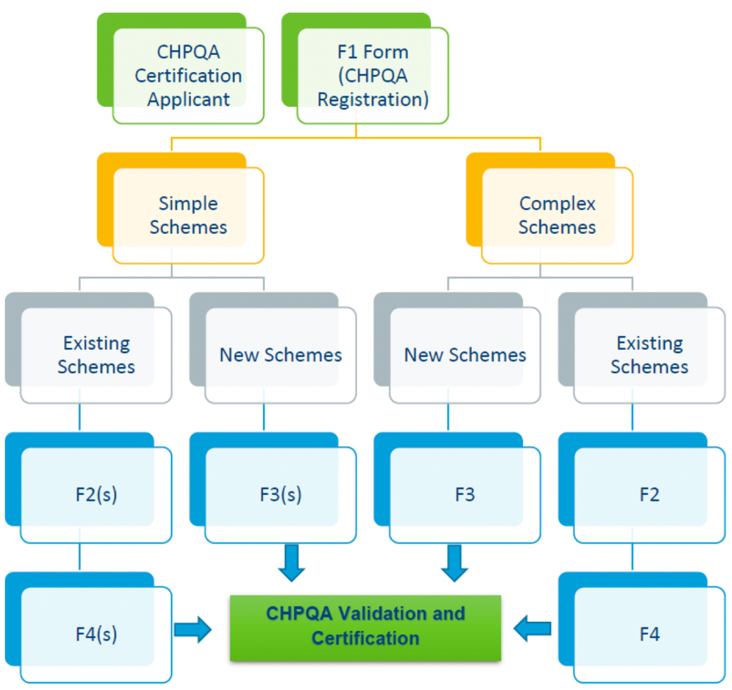
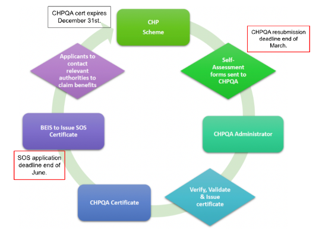

# CHPQA Application flow and required documentation

The scheme has 2 different classes, each with 2 subclasses;

-  Simple and Complex, 
-  New and Existing.

# 
  
# 
  

There are 2 brackets that a site may fall under in-terms of their returns on CCL:

- Good Quality - All qualifying input and outputs are considered Good Quality CHP (GQCHP) and scheme is fully qualified, maximizing % return of CCL. Qualifying is equal to the Total.
- Scheme failing - In this case the required threshold is not met, qualifying inputs and outputs are scaled back/reduced reducing % return of CCL. Qualifying is less than Total.

# Needed forms
- [F1 form - Starter form (Registration form)](https://assets.publishing.service.gov.uk/government/uploads/system/uploads/attachment_data/file/583648/CHPQA_FormF1.pdf)
- [F2 form - All complex schemes  - needs resubmitting if changes are made to scheme]
- F2(s) form - All simple schemes - needs resubmitting if changes are made to scheme
- F3 form - Complex new scheme only
- F3(s) form - Simple new scheme only
- F4 form - Complex existing scheme only - Must be resubmitted each year
- F4(s) form - Simple existing scheme only - Must be resubmitted each year

These forms compile all the calculations and values for CHPQA certification along with the evidence needed to prove these values are accurate.

# Additional forms

Use Form PP10 to give HMRC details to support your certificate of entitlement to relief from the main rates of Climate Change Levy (CCL) and work out the total relief to use on form PP11 supplier certificate. Once you have completed the PP10, copy and post to HMRC. Use form PP11 to tell your supplier the level of relief to use against your liability to Climate Change Levy. Send the completed Supplier Certificate (PP11) to the fuel supplier.

# Where all forms are sent (F1-4 all types):
The Administrator, CHPQA programme, The Gemini Building, Fermi Avenue, Didcot, OX11 0QR.
Registered on-site person CHPQA will contact: The Representative Person or RP
Distributor of Secretary of State certificate (SOS CHP): BEIS
To reclaim CCL: HMRC through forms PP10 
Supplier information: Send form PP11 to fuel suppliers to inform on level of relief against CCL

