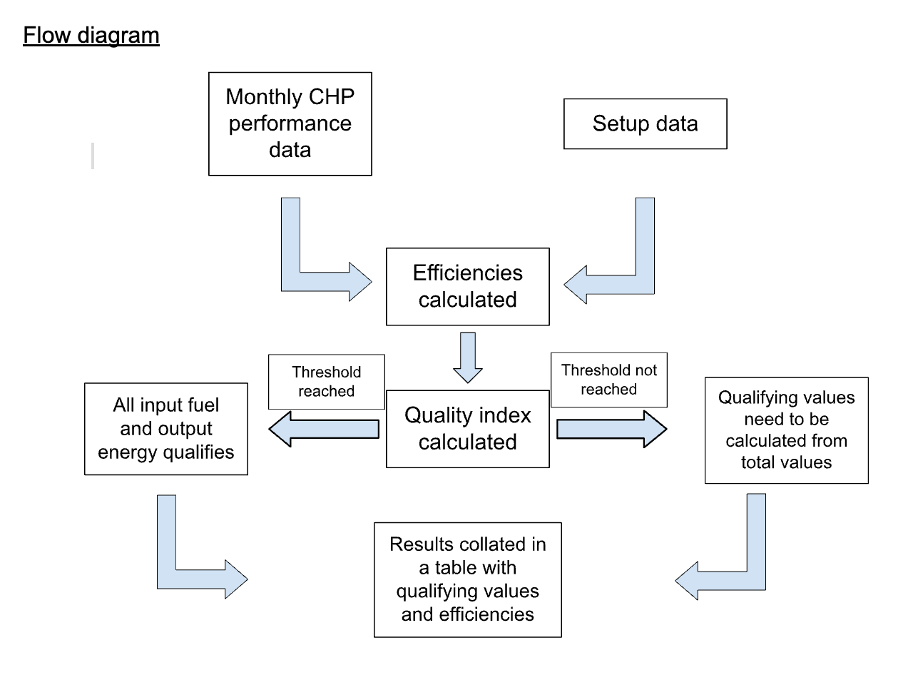

# Introduction - Combined Heat and Power Quality Assurance (CHPQA)

Background:

Sites such as hospitals and large commercial sites may have on-site CHP plants (Combined heat and power) which are used to generate electricity and heat for usage and export back to the grid. 

CHPQA allows sites to claim benefits in the form of:

- Climate Change Levy (CCL) exemptions
- Enhanced Capital allowances (ECAs)
- Exemption from business rating of CHP plant and machinery
- Carbon Price Support (CPS) exemption

Aims of the tool:

- Calculate monthly and annual CHP efficiency & Quality index value
- Forecast annual values for CHPQA for next certification period
- Provide advice and tips to help improve and increase runtime efficiency and increase qualifying input fuel and energy output.
# 
  

# 
  

# 
  

Data we need:

On setup:

- CHP scheme setup (plant, boilers, steam turbines, etc.)
- Meter schematics including accuracy of reading values
- Qualifying output heat

Each month:

- CHP performance data, along with any other scheme data (boilers, steam generators, etc.)

Reporting:

- Monthly reporting of CHP performance  along with tips on improving performance.
- Notification and advice if CHP is not forecasted to reach required threshold.
- Estimation of annual savings based on
- CHP performance and usage data.
- Final CHPQA values for new program reporting.

# 
  

