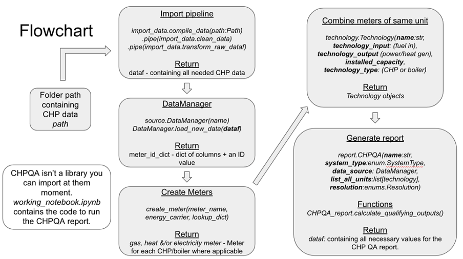

# Documentation 

# 
 

# What are the inputs required? In what format? 

performance_data: pd.Dataframe: Data pertaining to the performance of the CHP system (+ boilers) for the year so far. Note: Previous year data is not required as each CHP certificate only lasts a year and does not consider previous performance.

# What are the outputs? In what format? 

performance_metrics: pd.DataFrame - The output table contains all the necessary metrics for the period in question including quality index, power efficiency, heat efficiency and qualifying input & output values.
